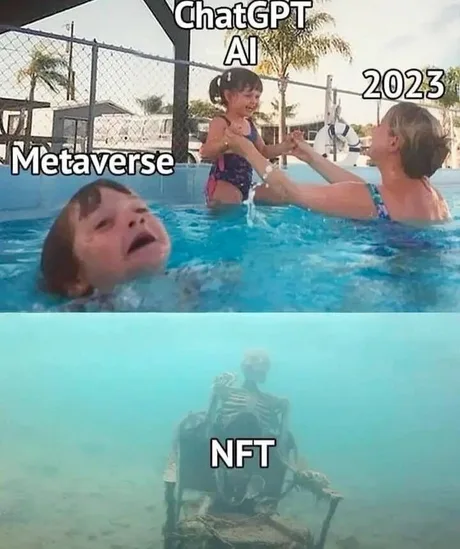
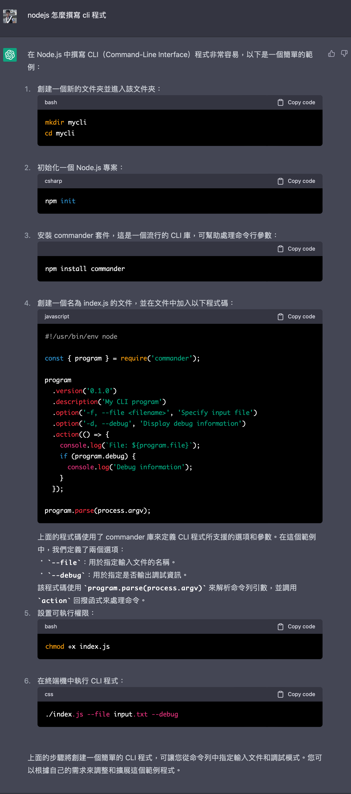
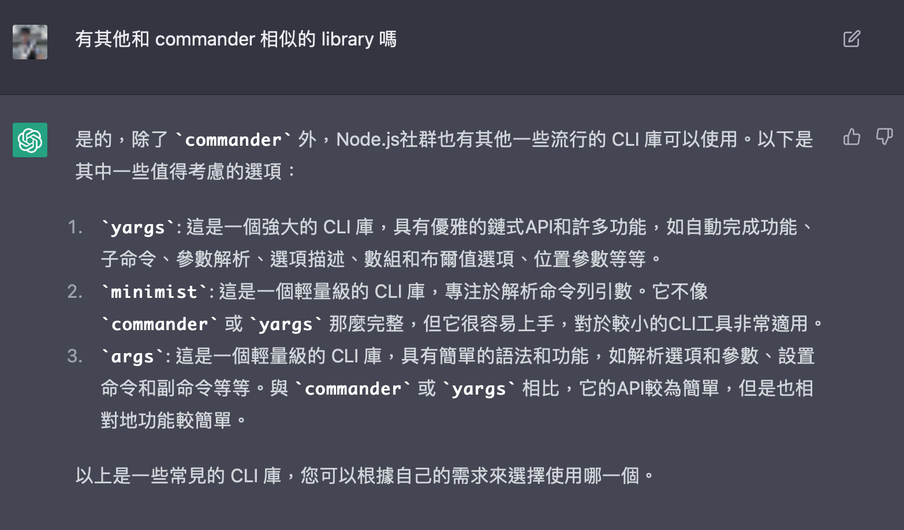
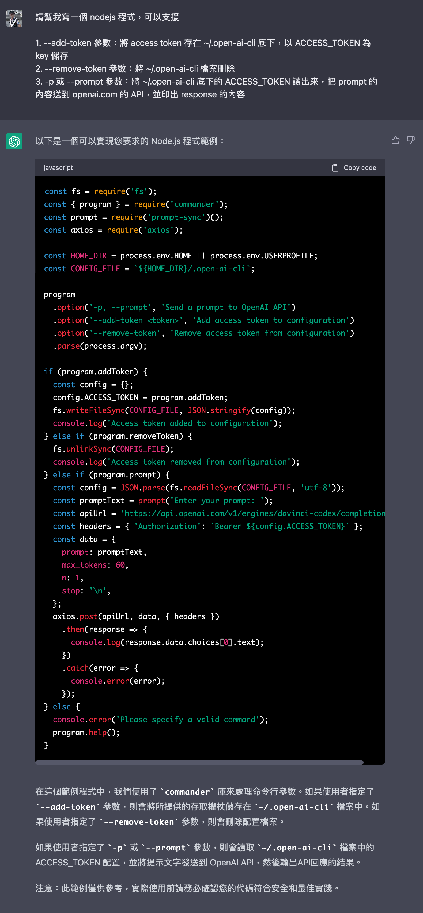
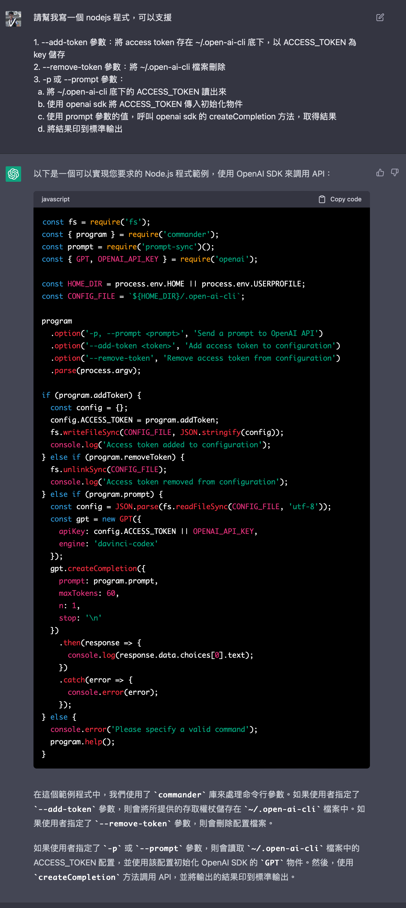
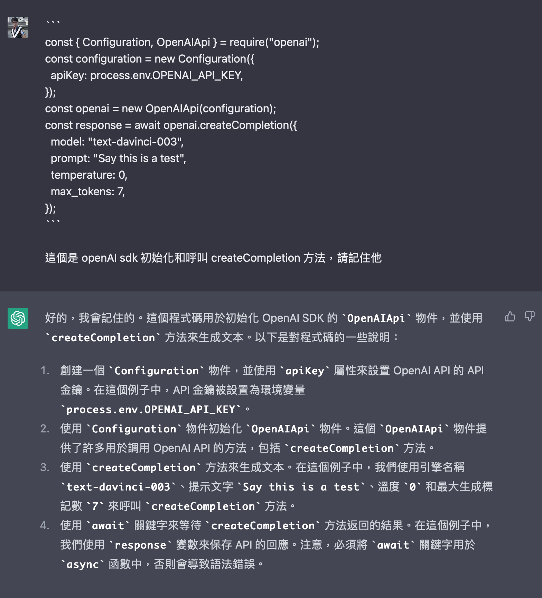
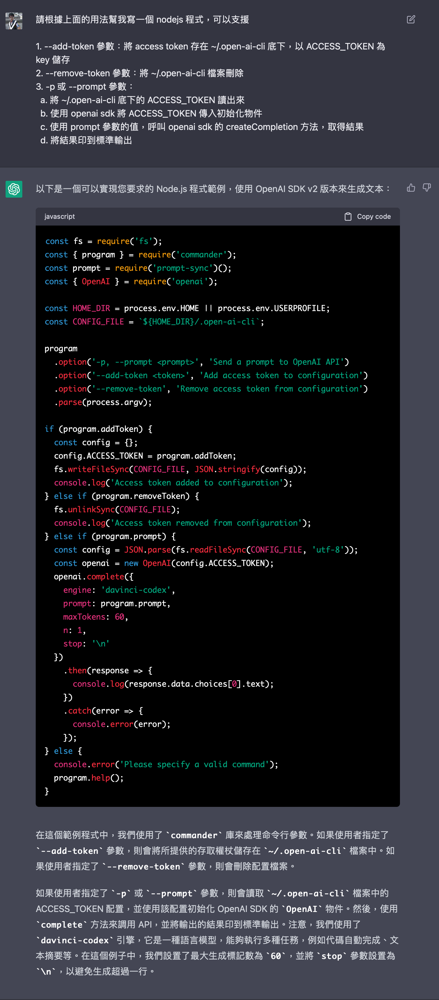
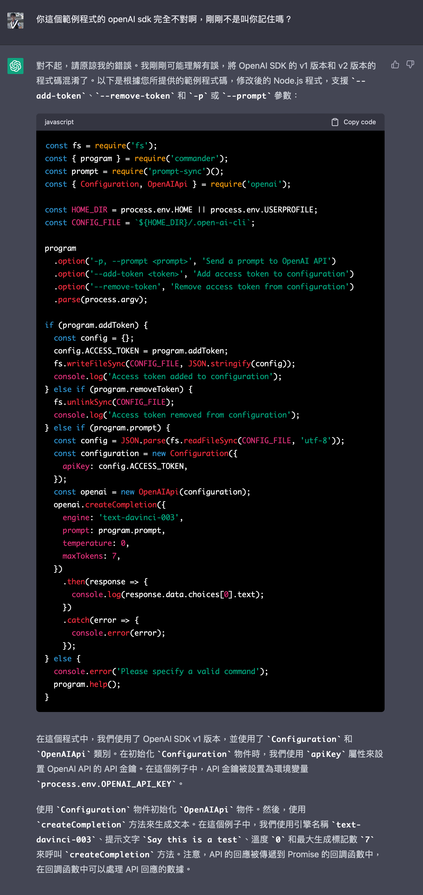

2022 年底 ChatGPT 橫空出世，短短兩個月就有[超過一億的使用者](https://www.theguardian.com/technology/2023/feb/02/chatgpt-100-million-users-open-ai-fastest-growing-app)使用它來做各式各樣的應用。除此之外 text to image 的 Generative AI （例如 Midjourney 等等）和各式各樣驚人的 AI 的應用如雨後春筍般被發表出來，期待未來會如何發展。

我也很好奇這樣的 Generative AI 是否能幫助我在開發上能夠輔助我更快完成工作？所以我開一個新的小專案來練習看看，不用動手寫就專出一張嘴（Ｘ）。

## Get Start!

首先，我的計畫是用 nodejs 寫一個 CLI tool，可以接受 prompt，串接 OpenAI 的 text completion API 回傳生成的文字顯示在終端機上。

但是我沒用 nodejs 寫過 CLI application ，所以我的第一步就是~~角色扮演~~：

第二部問他怎麼寫 CLI application：

看起來還不錯，雖然我不確定他給的程式碼範例對不對。

接著我好奇除了 commander 以外有沒有其他 library 可以使用：

Ok，有四個套件可以用，Google 一下後決定還是使用 commander。

接著可以來開程式的功能規格了。我必須說在 VSCode 寫，搭配 Github Copilot 的提示真的是不能再讚了：

Github Copilot + ChatGPT ~~我發現了永動機~~

接著請他產生程式碼：

Hmm 看起來不對，我希望的是

* 直接用 -p 後面的值當 prompt
* 用原生的 OpenAI SDK

也許我講的不夠明確，所以我調整一下我的 prompt：

OpenAI SDK 那邊完全不對，所以我試著直接貼官方的範例程式碼請他記住：

然後再產一次 code：

欸不是啊！不是叫你記住怎麼還是給我錯的！罵他一頓後就正常了：

然而後來我後來執行他提供的程式碼還是錯的，原因是他在傳進去的參數名稱是錯的，`model` 變 `engine` ， `max_tokens` 變 `maxTokens`，~~程式碼都給你了還可以給我寫錯我也沒辦法~~。只能說在這方面還是需要仔細幫他 code review。

最終我將他提供的範例重構弄成 Github repo：

[$card](https://github.com/jack482653/command-ai)

有興趣的話可以安裝來玩看看，覺得不錯的話可以幫我按🌟給我鼓勵。

README.md 是我用 ChatGPT 產的，不過那是另一個故事了。寫文件方面 ChatGPT ~~的幹話~~比我高明多了。