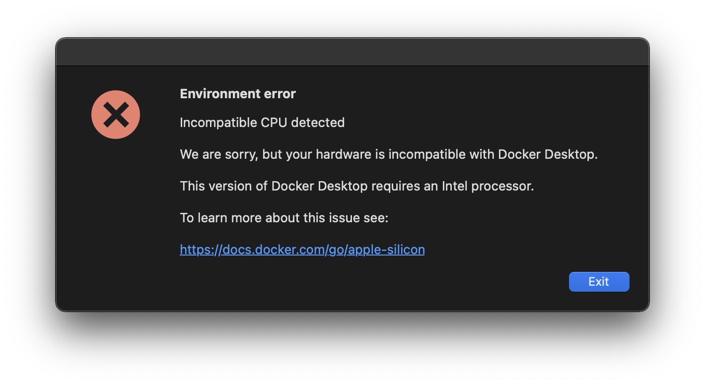
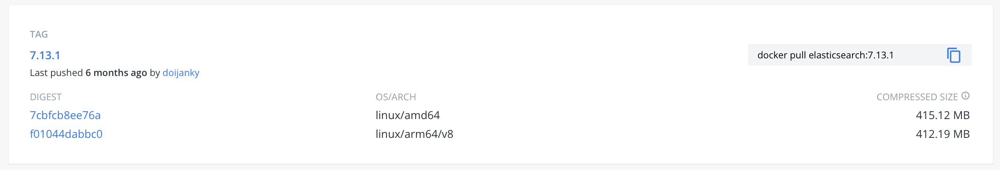

之前一直在用 2015 年款的 MacBook Pro，平常沒用作開發其實還算夠用。最近開始開發 Rails 專案後發現每寫完一段程式碼重 build 就花了很多時間😭。

因此在 2021 年款 MacBook Pro 開賣後我就馬上訂了一台。我的目標是買 14" M1 Pro，本來考慮客製記憶體加到 32GB、硬碟加到 1TB，外加英文鍵盤，但是要等到年底才會出貨，所以我最後還是決定買 14" 最低階的。目前用到現在為止同時在本機起兩個專案、執行 Docker container，以及開了一堆分頁的 Safari 和 Chrome 都還是非常順暢。我對這台電腦非常滿意😄。

~~然而身為一名資深踩雷工程師，換新電腦也要踩雷是一件很自然的事。~~這篇紀錄我在轉移新電腦時遇到的各式各樣的雷，希望其他跟我一樣換新電腦的人也能夠順暢無痛的轉換。

這篇是基於我建置 Ruby On Rails、React 跟 Docker 時遇到的問題，如果是別的語言的話就不適用喔。

# Migration
官方有 `系統移轉輔助程式` 可以使用，請參考[將內容搬移到新的 Mac](https://support.apple.com/zh-tw/HT204350)。

然後在這個步驟建議是如果你有用 Homebrew 的套件管理系統的話，不要勾選 `Other Files & Folders` ，之後再自己重裝，否則打開終端機會看到各種錯誤 QQ 。個人資料夾的話可以根據自己的需要酌量選擇。 我的檔案大小約莫 100 多 GB， Migration 的時間約在一個小時左右。

需要特別注意 homebrew 的 PATH 改到 `/opt/homebrew/bin` 了，可以將以下指令加到 shell 的設定檔，他會自動幫你加 homebrew 的 PATH：

```bash
eval "$(/opt/homebrew/bin/brew shellenv)"
```

# 各式各樣的雷

## node 爛掉

如果執行 node 發生以下的錯誤：

```
env: node: Bad CPU type in executable
```

代表之前裝的 node 是在 amd64 編譯的，請重裝 node

```bash
nvm uninsatll ${VERSION}
nvm install ${VERSION}
```

中間可能因為 xcode 爛掉而安裝失敗，請服用 [npm install fails on node-gyp rebuild with gyp: No Xcode or CLT version detected!](https://stackoverflow.com/questions/60573595/npm-install-fails-on-node-gyp-rebuild-with-gyp-no-xcode-or-clt-version-detec) 的解答：

``` bash
# just for а preview (not necessary)
xcode-select --print-path
# in my case it printed `/Library/Developer/CommandLineTools`

# could be useful if the path is making a problem
sudo xcode-select --switch /Library/Developer/CommandLineTools

# only for the (I) resetting case
sudo xcode-select --reset

# only for the (II) uninstalling case - the next line deletes folder returned by the `xcode-select --print-path` command
sudo rm -rf $(xcode-select --print-path)


# only for the (II) uninstalling case - install tools (again) if you don't get a default installation prompt
xcode-select --install
```

## Ruby

### gem install 爛掉

如果執行 `gem install` 發生以下錯誤：

```bash
→ gem install bundler
dyld[39009]: Library not loaded: /usr/local/opt/gmp/lib/libgmp.10.dylib
  Referenced from: /Users/zhangwuxian/.rvm/rubies/ruby-2.7.4/bin/ruby
  Reason: tried: '/usr/local/opt/gmp/lib/libgmp.10.dylib' (no such file), '/usr/local/lib/libgmp.10.dylib' (no such file), '/usr/lib/libgmp.10.dylib' (no such file)
```

請重裝 ruby（以 2.7.4 為例）：

```bash
rvm reinstall 2.7.4
```

### 安裝舊版 Ruby 爛掉

有一個專案用 ruby 2.5.1，嘗試著安裝發生了以下錯誤：

```
installing Ruby from source to: /Users/zhangwuxian/.rvm/rubies/ruby-2.5.1, this may take a while depending on your cpu(s)...
ruby-2.5.1 - #downloading ruby-2.5.1, this may take a while depending on your connection...
ruby-2.5.1 - #extracting ruby-2.5.1 to /Users/zhangwuxian/.rvm/src/ruby-2.5.1 - please wait
ruby-2.5.1 - #applying patch /Users/zhangwuxian/.rvm/patches/ruby/2.5.1/libressl_2_7.patch - please wait
ruby-2.5.1 - #configuring - please wait
Error running './configure --prefix=/Users/zhangwuxian/.rvm/rubies/ruby-2.5.1  --with-opt-dir=/opt/homebrew/opt/libyaml:/opt/homebrew/opt/libksba:/opt/homebrew/opt/readline:/opt/homebrew/opt/zlib:/opt/homebrew/opt/openssl@1.1 --disable-install-doc --enable-shared',
please read /Users/zhangwuxian/.rvm/log/1639279721_ruby-2.5.1/configure.log
There has been an error while running configure. Halting the installation.
```

看了一下 log:

```
configure: WARNING: you should use --build, --host, --target
checking for ruby... /Users/zhangwuxian/.rvm/rubies/ruby-2.7.4/bin/ruby
tool/config.guess already exists
tool/config.sub already exists
checking build system type... Invalid configuration `arm64-apple-darwin21.1.0': machine `arm64-apple' not recognized
configure: error: /bin/sh tool/config.sub arm64-apple-darwin21.1.0 failed
```

嘗試很多方法都不行，最後只好改安裝 2.6.9 就正常了。

但是 bundle install 遇到以下問題：

```
10 warnings and 1 error generated.
make: *** [Function.o] Error 1

make failed, exit code 2

Gem files will remain installed in /Users/zhangwuxian/.rvm/gems/ruby-2.6.9/gems/ffi-1.9.25 for inspection.
Results logged to /Users/zhangwuxian/.rvm/gems/ruby-2.6.9/extensions/arm64-darwin-21/2.6.0/ffi-1.9.25/gem_make.out
```

執行以下指令再重新 `bundle install` 即可：

```bash
bundle config build.ffi -- --with-cflags=-Wno-implicit-function-declaration
```

參考資料：
* [I can't install ffi gem - MacOS Big Sur 11.0.1](https://stackoverflow.com/questions/64953877/i-cant-install-ffi-gem-macos-big-sur-11-0-1)

### bundle install 爛掉

```
Gem::Ext::BuildError: ERROR: Failed to build gem native extension.

    current directory: /Users/zhangwuxian/.rvm/gems/ruby-2.7.4/gems/mimemagic-0.3.10/ext/mimemagic
/Users/zhangwuxian/.rvm/rubies/ruby-2.7.4/bin/ruby -I/Users/zhangwuxian/.rvm/rubies/ruby-2.7.4/lib/ruby/2.7.0/rubygems -rrubygems
/Users/zhangwuxian/.rvm/gems/ruby-2.7.4/gems/rake-13.0.6/exe/rake RUBYARCHDIR\=/Users/zhangwuxian/.rvm/gems/ruby-2.7.4/extensions/arm64-darwin-21/2.7.0/mimemagic-0.3.10
RUBYLIBDIR\=/Users/zhangwuxian/.rvm/gems/ruby-2.7.4/extensions/arm64-darwin-21/2.7.0/mimemagic-0.3.10
rake aborted!
Could not find MIME type database in the following locations: ["/usr/local/share/mime/packages/freedesktop.org.xml", "/opt/homebrew/share/mime/packages/freedesktop.org.xml",
"/opt/local/share/mime/packages/freedesktop.org.xml", "/usr/share/mime/packages/freedesktop.org.xml"]

Ensure you have either installed the shared-mime-info package for your distribution, or
obtain a version of freedesktop.org.xml and set FREEDESKTOP_MIME_TYPES_PATH to the location
of that file.

This gem might be installed as a dependency of some bigger package, such as rails, activestorage,
axlsx or cucumber. While most of these packages use the functionality of this gem, some gems have
included this gem by accident. Set USE_FREEDESKTOP_PLACEHOLDER=true if you are certain that you
do not need this gem, and wish to skip the inclusion of freedesktop.org.xml.

The FREEDESKTOP_PLACEHOLDER option is meant as a transitional feature, and will be deprecated in
the next release.
/Users/zhangwuxian/.rvm/gems/ruby-2.7.4/gems/mimemagic-0.3.10/ext/mimemagic/Rakefile:15:in `locate_mime_database'
/Users/zhangwuxian/.rvm/gems/ruby-2.7.4/gems/mimemagic-0.3.10/ext/mimemagic/Rakefile:39:in `block in <top (required)>'
/Users/zhangwuxian/.rvm/gems/ruby-2.7.4/gems/rake-13.0.6/exe/rake:27:in `<main>'
Tasks: TOP => default
(See full trace by running task with --trace)

rake failed, exit code 1

Gem files will remain installed in /Users/zhangwuxian/.rvm/gems/ruby-2.7.4/gems/mimemagic-0.3.10 for inspection.
Results logged to /Users/zhangwuxian/.rvm/gems/ruby-2.7.4/extensions/arm64-darwin-21/2.7.0/mimemagic-0.3.10/gem_make.out

An error occurred while installing mimemagic (0.3.10), and Bundler cannot continue.
Make sure that `gem install mimemagic -v '0.3.10' --source 'https://rubygems.org/'` succeeds before bundling.

In Gemfile:
  kt-paperclip-optimizer was resolved to 3.0.0, which depends on
    kt-paperclip was resolved to 6.4.1, which depends on
      mimemagic
```

這個跟 M1 沒有關係，只是少裝東西而已：

```bash
brew install shared-mime-info
```

再重新 `bundle install` 即可。

## Docker

### 啟動 Docker 爛掉

啟動 Docker 時出現

```
Environment error
Incompatible CPU detected
We are sorry, but your hardware is incompatible with Docker Desktop.
This version of Docker Desktop requires an Intel processor.
To learn more about this issue see:
https://docs.docker.com/go/apple-silicon
```



請前往 [Docker Desktop for Apple silicon](https://docs.docker.com/desktop/mac/apple-silicon/) 下載 Apple Silicon 專用的 Docker 即可。

### Pull docker image 爛掉

```
→ docker-compose -f docker-compose.dev.yml up
[+] Running 1/10
 ⠹ apm-server Pulling                                                                                                                                                                 4.3s
   ⠿ c808caf183b6 Already exists                                                                                                                                                      0.0s
   ⠴ 62a788ce9f22 Pulling fs layer                                                                                                                                                    0.6s
   ⠴ f1d963553a74 Pulling fs layer                                                                                                                                                    0.6s
   ⠴ d92a8cefa956 Pulling fs layer                                                                                                                                                    0.6s
   ⠦ 45267eabfeb9 Waiting                                                                                                                                                             0.6s
   ⠦ bd222225b8a8 Waiting                                                                                                                                                             0.6s
   ⠦ e83b305004f7 Waiting                                                                                                                                                             0.6s
 ⠹ logstash Pulling                                                                                                                                                                   4.3s
 ⠹ kibana Pulling                                                                                                                                                                     4.3s
no matching manifest for linux/arm64/v8 in the manifest list entries
```

你可以在 `docker-compose.yml` 的 service 加上 `platform: linux/amd64` 指定目標 service 執行時的 platform 為 linux/amd64，或是更激進的直接設定環境變數 `export DOCKER_DEFAULT_PLATFORM=linux/amd64` 讓 docker container 執行時 platform 都是用 linux/amd64（不過我沒試過）。

參考資料：
* [Mac M1系列-解決docker安裝mysql error:no matching manifest for linux/arm64/v8 in the manifest list entries](https://chilunhuang.github.io/posts/8942/)
* [Compose file version 2 reference](https://docs.docker.com/compose/compose-file/compose-file-v2/#platform)
* [Forcing docker to use linux/amd64 platform by default on macOS](https://stackoverflow.com/questions/65612411/forcing-docker-to-use-linux-amd64-platform-by-default-on-macos)

### ELK 起起來爛掉

如果用 docker 執行 ELK 發生以下錯誤：

```
logstash_1       | runtime: failed to create new OS thread (have 2 already; errno=22)
logstash_1       | fatal error: newosproc
logstash_1       |
logstash_1       | runtime stack:
logstash_1       | runtime.throw(0x532c50, 0x9)
logstash_1       | 	/usr/local/go/src/runtime/panic.go:596 +0x95
logstash_1       | runtime.newosproc(0xc420026000, 0xc420036000)
logstash_1       | 	/usr/local/go/src/runtime/os_linux.go:163 +0x18c
logstash_1       | runtime.newm(0x53ba58, 0x0)
logstash_1       | 	/usr/local/go/src/runtime/proc.go:1628 +0x137
logstash_1       | runtime.main.func1()
logstash_1       | 	/usr/local/go/src/runtime/proc.go:126 +0x36
logstash_1       | runtime.systemstack(0x5c5c00)
logstash_1       | 	/usr/local/go/src/runtime/asm_amd64.s:327 +0x79
logstash_1       | runtime.mstart()
logstash_1       | 	/usr/local/go/src/runtime/proc.go:1132
logstash_1       |
logstash_1       | goroutine 1 [running]:
logstash_1       | runtime.systemstack_switch()
logstash_1       | 	/usr/local/go/src/runtime/asm_amd64.s:281 fp=0xc420022788 sp=0xc420022780
logstash_1       | runtime.main()
logstash_1       | 	/usr/local/go/src/runtime/proc.go:127 +0x6c fp=0xc4200227e0 sp=0xc420022788
logstash_1       | runtime.goexit()
logstash_1       | 	/usr/local/go/src/runtime/asm_amd64.s:2197 +0x1 fp=0xc4200227e8 sp=0xc4200227e0
logstash_1 exited with code 2
apm-server_1     | 2021-12-12T02:51:41.376Z	INFO	[request]	middleware/log_middleware.go:97	request ok	{"request_id": "8b6d051a-c4bf-4f03-9e1b-7fc122ec6498", "method": "GET", "URL": "/", "content_length": 0, "remote_address": "127.0.0.1", "user-agent": "curl/7.29.0", "response_code": 200}
elasticsearch_1  | Exception in thread "main" java.io.IOException: Cannot run program "/usr/share/elasticsearch/jdk/bin/java": error=0, Failed to exec spawn helper.
elasticsearch_1  | 	at java.base/java.lang.ProcessBuilder.start(ProcessBuilder.java:1128)
elasticsearch_1  | 	at java.base/java.lang.ProcessBuilder.start(ProcessBuilder.java:1071)
elasticsearch_1  | 	at org.elasticsearch.tools.launchers.JvmErgonomics.flagsFinal(JvmErgonomics.java:111)
elasticsearch_1  | 	at org.elasticsearch.tools.launchers.JvmErgonomics.finalJvmOptions(JvmErgonomics.java:88)
elasticsearch_1  | 	at org.elasticsearch.tools.launchers.JvmErgonomics.choose(JvmErgonomics.java:59)
elasticsearch_1  | 	at org.elasticsearch.tools.launchers.JvmOptionsParser.main(JvmOptionsParser.java:95)
elasticsearch_1  | Caused by: java.io.IOException: error=0, Failed to exec spawn helper.
elasticsearch_1  | 	at java.base/java.lang.ProcessImpl.forkAndExec(Native Method)
elasticsearch_1  | 	at java.base/java.lang.ProcessImpl.<init>(ProcessImpl.java:319)
elasticsearch_1  | 	at java.base/java.lang.ProcessImpl.start(ProcessImpl.java:250)
elasticsearch_1  | 	at java.base/java.lang.ProcessBuilder.start(ProcessBuilder.java:1107)
elasticsearch_1  | 	... 5 more
elasticsearch_1 exited with code 1
```


請到 Docker Hub 看一下 image 列表下哪一個版本的 OS/ARCH 有 `linux/arm64/v8`，並更新到支援 arm64 的 image 版本，如下圖：



參考資料：
* [Failed to create new OS thread (have 2 already; errno=22)](https://stackoverflow.com/questions/66349391/failed-to-create-new-os-thread-have-2-already-errno-22)

## 其他雜七雜八的問題

### Spotify 啟動時黑畫面

請參考 [Spotify | 問題 | 在Macbook Pro M1上如何正常運作不黑屏？](https://ab20803.medium.com/spotify-%E5%95%8F%E9%A1%8C-%E5%9C%A8macbook-pro%E4%B8%8A%E5%A6%82%E4%BD%95%E6%AD%A3%E5%B8%B8%E9%81%8B%E4%BD%9C%E4%B8%8D%E9%BB%91%E5%B1%8F-8e01e26f7df2)

### 藍牙耳機莫名其妙切到 SBC codec

目前新版的 Additional Tools for Xcode 已經把 `Bluetooth Explorer` 拿掉了，如果用舊版的的 `Additional Tools` 去設定是沒有用的。

不太確定以下指令有沒有用，但是至少我下完後重開機音質變好了：

```shell
sudo defaults write bluetoothaudiod "Enable AptX codec" -bool true
sudo defaults write bluetoothaudiod "Enable AAC codec" -bool true
```

然後我發現只要啟動麥克風（例如 Hey Siri），藍牙耳機就會莫名其妙被切回 SBC ，目前的解決方式只能強迫音源輸入使用 MacBook 內建的避開。

參考資料：
* [How to Enable the Optimal Audio Codec for Your Bluetooth Headphones in macOS](https://www.macrumors.com/how-to/enable-aptx-aac-bluetooth-audio-codecs-macos/)